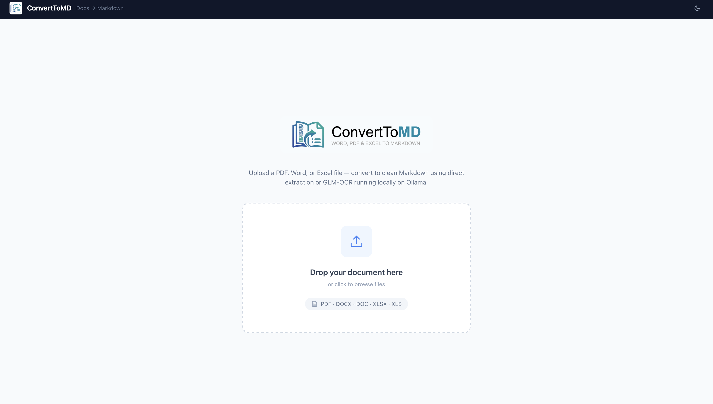

# ConvertToMD — Document to Markdown Converter

<p align="center">
  
</p>


**ConvertToMD** is a fully local web application that converts PDF, DOCX, DOC, XLSX, and XLS files into clean, well-structured Markdown. All processing happens on your machine — no file is ever uploaded to an external service.

The application offers two conversion modes:

- **Direct** — structure-preserving extraction for DOCX and XLSX files using `python-docx` and `openpyxl`. Fast and deterministic.
- **OCR** — AI-powered page-by-page conversion for PDFs and legacy Office formats (DOC, XLS) via [Ollama](https://ollama.com) running locally with the `glm-ocr` model.

A standalone **CLI batch converter** (`scripts/convert.py`) is also included for processing entire folders without the web interface.

---

## Features

- Upload and convert PDF, DOCX, DOC, XLSX, XLS files
- Split-view interface: original document page rendered alongside the extracted Markdown
- Per-page OCR with progress tracking, or one-click "OCR All"
- Download the complete Markdown output as a `.md` file
- Dark mode support
- 100% offline — Ollama runs locally, no API keys required
- CLI tool for batch processing with configurable DPI, model, and timeout

---

## Architecture

```
ConvertToMD/
├── backend/          # FastAPI application
│   ├── main.py       # REST API endpoints
│   ├── converters.py # DOCX/XLSX direct converters + LibreOffice PDF bridge
│   └── requirements.txt
├── frontend/         # React + Vite + Tailwind CSS
│   └── src/
│       ├── App.jsx
│       ├── api.js
│       └── components/
├── scripts/
│   ├── convert.py    # CLI batch converter
│   └── requirements.txt
├── raw/              # (gitignored) Input documents
├── output/           # (gitignored) Converted Markdown files
└── start.sh          # One-command startup script
```

| Layer | Technology |
|-------|-----------|
| Backend | Python 3.11+, FastAPI, Uvicorn |
| PDF rendering | PyMuPDF (fitz) |
| DOCX extraction | python-docx |
| XLSX extraction | openpyxl |
| DOC/XLS → PDF | LibreOffice (headless) |
| OCR engine | Ollama + `glm-ocr:latest` |
| Frontend | React 18, Vite, Tailwind CSS |
| HTTP client | httpx |

---

## Prerequisites

| Requirement | Notes |
|-------------|-------|
| Python 3.11+ | Backend and CLI |
| Node.js 18+ | Frontend |
| [Ollama](https://ollama.com) | Required for OCR mode |
| `glm-ocr:latest` model | Pulled via `ollama pull glm-ocr:latest` |
| LibreOffice | Optional — required only for OCR mode on `.doc` / `.xls` files |

---

## Installation and Quick Start

### 1. Clone the repository

```bash
git clone https://github.com/giova86/ConvertToMD
cd ConvertToMD
```

### 2. Pull the OCR model

```bash
ollama pull glm-ocr:latest
```

### 3. Start the application

```bash
./start.sh
```

The script will:
1. Start Ollama in the background
2. Install Python backend dependencies (inside an existing `venv` if present, otherwise globally)
3. Start the FastAPI backend on `http://localhost:8000`
4. Install Node frontend dependencies
5. Start the Vite dev server on `http://localhost:5173`

Open `http://localhost:5173` in your browser.

Press `Ctrl+C` to stop all services.

### Manual setup (alternative)

**Backend:**
```bash
cd backend
python -m venv venv
source venv/bin/activate        # Windows: venv\Scripts\activate
pip install -r requirements.txt
uvicorn main:app --reload --port 8000
```

**Frontend:**
```bash
cd frontend
npm install
npm run dev
```

---

## Usage

### Web Interface

1. Drag and drop or click to upload a file (PDF, DOCX, DOC, XLSX, XLS).
2. For DOCX / XLSX files, choose a conversion mode:
   - **Direct** — instant structural extraction, no AI required.
   - **OCR** — renders each page as an image and passes it to the local AI model.
3. Use the split view to inspect each page alongside its Markdown output.
4. Click **OCR All** to process every page automatically, or convert pages individually.
5. Download the result as a `.md` file.

### Supported Formats

| Format | Direct mode | OCR mode |
|--------|:-----------:|:--------:|
| PDF    |             | ✓        |
| DOCX   | ✓           | ✓        |
| DOC    |             | ✓        |
| XLSX   | ✓           | ✓        |
| XLS    |             | ✓        |

---

## CLI Batch Converter

`scripts/convert.py` processes all supported files in an input directory and writes Markdown to an output directory.

### Setup

```bash
cd scripts
pip install -r requirements.txt
```

### Basic usage

```bash
# Convert everything in ../raw → ../output (default paths)
python convert.py

# Specify custom paths
python convert.py -i /path/to/docs -o /path/to/output

# Force re-conversion of already-converted files
python convert.py --force

# Force OCR for all files (including DOCX/XLSX)
python convert.py --mode ocr
```

### All options

```
usage: convert.py [-h] [-i DIR] [-o DIR] [-f] [--mode {auto,direct,ocr}]
                  [--dpi INT] [--model STR] [--ollama-url URL] [--timeout SEC]

Options:
  -i, --input DIR       Input folder (default: ../raw)
  -o, --output DIR      Output folder (default: ../output)
  -f, --force           Re-process already-converted files
  --mode {auto,direct,ocr}
                        auto = smart selection; direct = python-docx/openpyxl;
                        ocr = Ollama pipeline (default: auto)
  --dpi INT             Render resolution for OCR pages (default: 200)
  --model STR           Ollama model name (default: glm-ocr:latest)
  --ollama-url URL      Ollama API endpoint (default: http://localhost:11434/api/generate)
  --timeout SEC         Per-page OCR timeout in seconds (default: 180)
```

**Conversion modes:**

| Mode | Behavior |
|------|----------|
| `auto` (default) | Direct for DOCX/XLSX; OCR for PDF, DOC, XLS |
| `direct` | Always uses python-docx / openpyxl (errors on unsupported formats) |
| `ocr` | Always uses the Ollama pipeline (requires LibreOffice for Office formats) |

---

## API Reference

The backend exposes the following REST endpoints on `http://localhost:8000`:

| Method | Endpoint | Description |
|--------|----------|-------------|
| `POST` | `/api/upload` | Upload a PDF; returns page images as base64 |
| `POST` | `/api/convert-direct` | Direct DOCX/XLSX → Markdown extraction |
| `POST` | `/api/convert-to-pdf` | Convert DOCX/DOC/XLSX/XLS to PDF via LibreOffice, then render pages |
| `POST` | `/api/ocr-page` | Run OCR on a single base64-encoded page image |
| `GET`  | `/api/health` | Health check |

Interactive API documentation is available at `http://localhost:8000/docs` (Swagger UI).

---

## Configuration

| Variable | Location | Default | Description |
|----------|----------|---------|-------------|
| `OLLAMA_URL` | `backend/main.py` | `http://localhost:11434/api/generate` | Ollama API endpoint |
| `OCR_MODEL` | `backend/main.py` | `glm-ocr:latest` | Ollama model used for OCR |
| `RENDER_DPI` | `backend/main.py` | `200` | Page render resolution |
| Backend port | `start.sh` | `8000` | Uvicorn listen port |
| Frontend port | `frontend/vite.config.js` | `5173` | Vite dev server port |

---

## Development

### Running tests

```bash
cd backend
source venv/bin/activate
pip install -r requirements-dev.txt
pytest test_main.py -v
```

### Building the frontend for production

```bash
cd frontend
npm run build
# Output is in frontend/dist/
```

---

## License

Copyright 2026 Giovanni Bocchi

Licensed under the **Apache License, Version 2.0**. You may use, copy, modify, and distribute this software freely, provided that:

- The original copyright notice and this license are preserved in all copies.
- The `NOTICE` file is included with any distribution.
- Any modifications are clearly documented.

See the [LICENSE](LICENSE) and [NOTICE](NOTICE) files for the full terms.

---

## Author

**Giovanni Bocchi**
[https://giova86.github.io/business_card/](https://giova86.github.io/business_card/)
